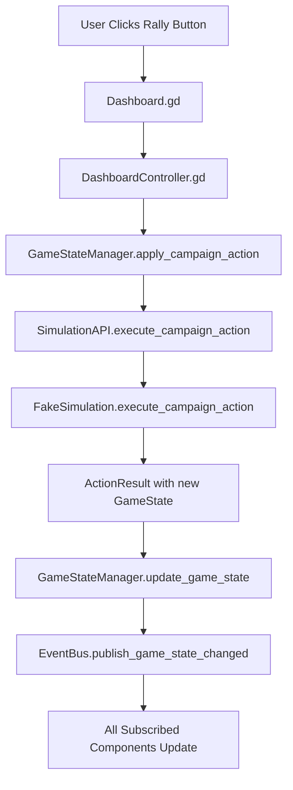
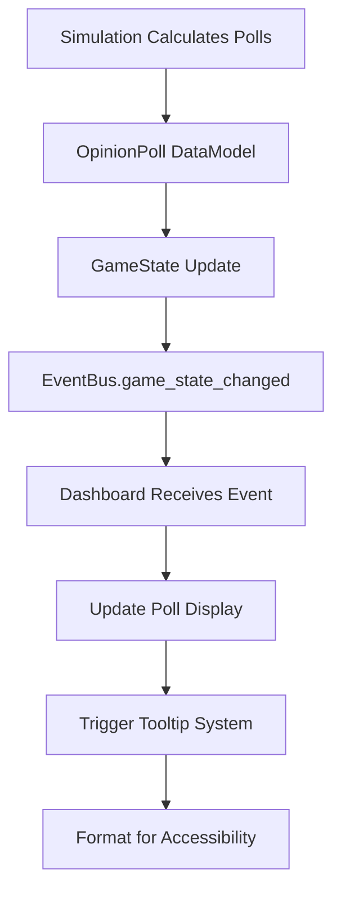
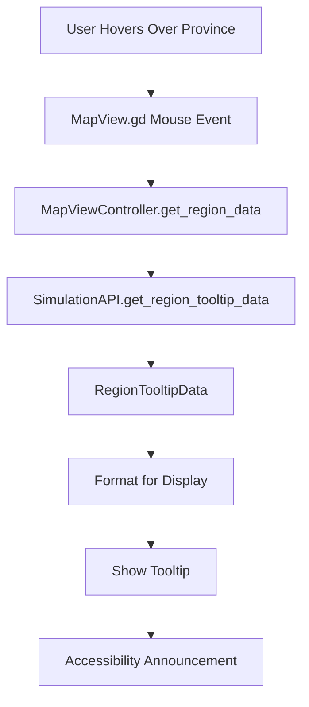
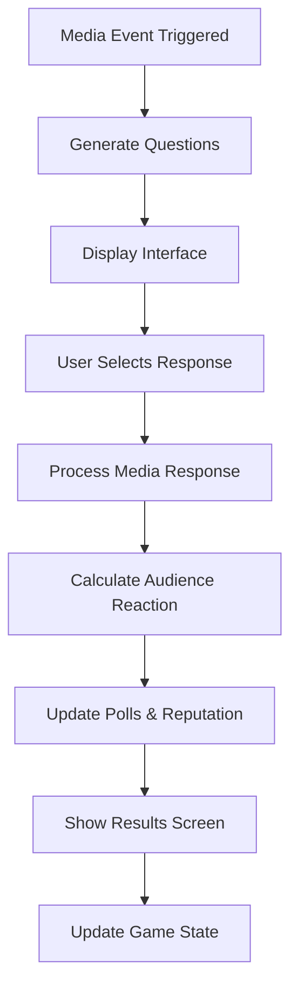

# Integration Guide

## Overview

This guide explains how components interact within the Dutch Politics Simulation UI, documenting data flows, integration patterns, and best practices for extending the system.

## Architecture Integration Patterns

### Clean Architecture Layers

The system implements clean architecture with clear dependency directions:

```
┌─ UI Layer (Godot Scenes) ─────────────────────────────┐
│  • Dashboard.tscn/.gd                                 │
│  • MapView.tscn/.gd                                   │
│  • CoalitionBuilder.tscn/.gd                          │
│  • MediaEvent.tscn/.gd                                │
└────────────┬───────────────────────────────────────────┘
             │ Events & Direct Calls
┌─ Controller Layer ─────────────────────────────────────┐
│  • DashboardController.gd                             │
│  • MapViewController.gd                               │
│  • CoalitionBuilderController.gd                      │
│  • MediaEventController.gd                            │
└────────────┬───────────────────────────────────────────┘
             │ State Updates & Events
┌─ Manager Layer (Autoloads) ───────────────────────────┐
│  • EventBus (Global Events)                           │
│  • GameStateManager (State Authority)                 │
│  • UIStateManager (UI State)                         │
│  • AccessibilityManager, LocalizationManager, etc.   │
└────────────┬───────────────────────────────────────────┘
             │ API Calls
┌─ Integration Layer ────────────────────────────────────┐
│  • SimulationIntegration.gd                          │
│  • Data Transformation & Validation                   │
└────────────┬───────────────────────────────────────────┘
             │ Interface Calls
┌─ Core API Layer ──────────────────────────────────────┐
│  • SimulationAPI.gd (Interface)                       │
│  • DataModels.gd (Type System)                        │
└────────────┬───────────────────────────────────────────┘
             │ Implementation
┌─ Simulation Layer ────────────────────────────────────┐
│  • FakeSimulation.gd (Current)                        │
│  • Future: AgentBasedSimulation.gd                    │
└────────────────────────────────────────────────────────┘
```

### Dependency Rules

1. **UI Layer** depends on Controllers and Managers
2. **Controllers** depend on Managers and EventBus
3. **Managers** depend on Integration Layer and EventBus
4. **Integration Layer** depends on Core API
5. **Core API** defines contracts (no dependencies)
6. **Simulation Layer** implements Core API contracts

## Data Flow Patterns

### 1. User Action → State Change Flow



**Code Example:**
```gd
# Dashboard.gd
func _on_rally_button_pressed():
    var action = DataModels.CampaignAction.new("rally", selected_region, 5000, 3)
    controller.execute_campaign_action(action)

# DashboardController.gd
func execute_campaign_action(action: DataModels.CampaignAction):
    var success = GameStateManager.apply_campaign_action(action)
    if success:
        EventBus.publish_notification_request("Rally organized successfully!", "success")

# GameStateManager.gd
func apply_campaign_action(action: DataModels.CampaignAction) -> bool:
    var result = simulation_api.execute_campaign_action(action, current_game_state)
    if result.success:
        update_game_state(result.new_state, "Campaign Action: " + action.action_type)
        return true
    return false
```

### 2. Simulation Data → UI Display Flow



**Code Example:**
```gd
# Dashboard.gd
func _ready():
    EventBus.subscribe("game_state_changed", _on_game_state_changed)

func _on_game_state_changed(data: Dictionary):
    var new_state = data.get("new_state") as DataModels.GameState
    _update_poll_display(new_state.current_polls)
    _update_funds_display(new_state.campaign_funds)
    _update_time_display(new_state.current_day, new_state.days_until_election)

func _update_poll_display(polls: Dictionary):
    var player_poll = polls.get("player_party", 0.0)
    poll_percentage_label.text = "%.1f%%" % player_poll

    # Add accessibility label for screen readers
    poll_percentage_label.set("accessible_name", "Current poll percentage: %.1f percent" % player_poll)

    # Register for explanatory tooltip
    EventBus.publish_tooltip_request(poll_percentage_label, _generate_poll_explanation(player_poll))
```

### 3. Map Interaction → Regional Data Flow



**Code Example:**
```gd
# MapView.gd
func _on_region_area_mouse_entered(region_id: String):
    controller.request_region_tooltip(region_id)

# MapViewController.gd
func request_region_tooltip(region_id: String):
    var current_state = GameStateManager.get_current_state()
    var tooltip_data = simulation_api.get_region_tooltip_data(region_id, current_state)

    var tooltip_content = _format_region_tooltip(tooltip_data)
    EventBus.publish_tooltip_request(region_area, tooltip_content)

func _format_region_tooltip(data: DataModels.RegionTooltipData) -> String:
    var content = "Region: %s\nPopulation: %s\n" % [data.region_name, _format_number(data.population)]
    content += "\nKey Issues:\n"
    for issue in data.key_issues:
        content += "• %s\n" % issue
    return content
```

### 4. Media Event → Response Processing Flow



**Code Example:**
```gd
# MediaEventController.gd
func start_media_event(event_type: String):
    var current_state = GameStateManager.get_current_state()
    var event = simulation_api.generate_media_event(event_type, current_state)

    # Store for response processing
    current_event = event
    current_question_index = 0

    # Display first question
    _display_question(event.questions[0])

func _on_response_selected(response: DataModels.ResponseOption):
    var current_question = current_event.questions[current_question_index]
    var current_state = GameStateManager.get_current_state()

    var response_result = simulation_api.process_media_response(
        response, current_question, current_state
    )

    # Show immediate feedback
    _display_audience_reaction(response_result.sentiment_change)

    # Continue to next question or show final results
    current_question_index += 1
    if current_question_index < current_event.questions.size():
        _display_question(current_event.questions[current_question_index])
    else:
        _show_event_summary(accumulated_results)
```

## Component Integration Patterns

### 1. Event-Driven Updates

Components use EventBus for loose coupling and reactive updates:

```gd
# Publisher Pattern
class CampaignController extends RefCounted:
    func execute_action(action):
        # Process action...
        EventBus.publish("campaign_action_executed", {
            "action": action,
            "result": result,
            "timestamp": Time.get_unix_time_from_system()
        })

# Subscriber Pattern
class Dashboard extends Control:
    func _ready():
        EventBus.subscribe("campaign_action_executed", _on_action_executed)
        EventBus.subscribe("game_state_changed", _on_state_changed)
        EventBus.subscribe("accessibility_changed", _on_accessibility_changed)

    func _exit_tree():
        EventBus.unsubscribe_all(self)  # Clean up all subscriptions
```

### 2. State Authority Pattern

GameStateManager is the single source of truth:

```gd
# CORRECT: Use GameStateManager as authority
func get_current_polls() -> Dictionary:
    var state = GameStateManager.get_current_state()
    return state.current_polls

# INCORRECT: Don't cache state in components
class Dashboard extends Control:
    var cached_polls: Dictionary  # This can become stale
```

### 3. Dependency Injection Pattern

Controllers receive dependencies through constructor or initialization:

```gd
# DashboardController.gd
class DashboardController extends RefCounted:
    var simulation_api: SimulationAPI
    var state_manager: GameStateManager
    var event_bus: EventBus

    func _init(p_simulation_api: SimulationAPI, p_state_manager: GameStateManager, p_event_bus: EventBus):
        simulation_api = p_simulation_api
        state_manager = p_state_manager
        event_bus = p_event_bus

# Dashboard.gd initialization
func _ready():
    controller = DashboardController.new(
        GameStateManager.simulation_api,
        GameStateManager,
        EventBus
    )
```

### 4. Command Pattern for Actions

Encapsulate user actions as command objects:

```gd
# CampaignCommand.gd
class CampaignCommand extends RefCounted:
    var action: DataModels.CampaignAction
    var target_state: DataModels.GameState
    var expected_cost: int

    func execute() -> DataModels.ActionResult:
        return GameStateManager.apply_campaign_action(action)

    func can_execute() -> bool:
        return target_state.campaign_funds >= expected_cost

# Usage
var command = CampaignCommand.new()
command.action = DataModels.CampaignAction.new("rally", "utrecht", 5000, 3)
command.target_state = GameStateManager.get_current_state()
command.expected_cost = 5000

if command.can_execute():
    var result = command.execute()
```

## Manager Integration Patterns

### Autoload Coordination

Managers coordinate through well-defined interfaces:

```gd
# GameStateManager coordinates with other managers
func update_game_state(new_state: DataModels.GameState, description: String):
    # Update internal state
    _create_state_snapshot(description)
    current_game_state = new_state

    # Notify other managers
    UIStateManager.on_game_state_changed(new_state)
    PerformanceMonitor.record_state_change()

    # Broadcast to all subscribers
    EventBus.publish_game_state_changed(new_state)

# AccessibilityManager responds to settings changes
func apply_accessibility_settings(settings: Dictionary):
    if settings.has("text_scale"):
        _apply_text_scaling(settings.text_scale)
    if settings.has("high_contrast"):
        _apply_high_contrast_theme(settings.high_contrast)

    # Notify other systems
    EventBus.publish_accessibility_change("settings_applied", settings)
```

### Manager Initialization Order

Autoloads initialize in project.godot order:

```ini
[autoload]
EventBus="*res://presentation/managers/event_bus.gd"                    # 1. First - needed by all
GameStateManager="*res://presentation/state_managers/game_state_manager.gd"  # 2. Core state
UIStateManager="*res://presentation/state_managers/ui_state_manager.gd"      # 3. UI state
AccessibilityManager="*res://presentation/managers/accessibility_manager.gd" # 4. Accessibility
LocalizationManager="*res://presentation/managers/localization_manager.gd"   # 5. Localization
# ... other managers
```

## Data Transformation Patterns

### SimulationAPI → UI Transformation

The integration layer transforms simulation data for UI consumption:

```gd
# SimulationIntegration.gd
class SimulationIntegration extends RefCounted:
    static func transform_poll_data_for_ui(poll: DataModels.OpinionPoll) -> Dictionary:
        var ui_data = {}

        # Sort parties by poll percentage for display
        var sorted_parties = []
        for party_id in poll.results.keys():
            sorted_parties.append({
                "id": party_id,
                "percentage": poll.results[party_id]
            })
        sorted_parties.sort_custom(func(a, b): return a.percentage > b.percentage)

        ui_data["sorted_parties"] = sorted_parties
        ui_data["methodology"] = "Sample size: %d, MOE: ±%.1f%%" % [poll.sample_size, poll.margin_of_error]
        ui_data["poll_date"] = poll.poll_date

        return ui_data

    static func format_currency_for_locale(amount: int) -> String:
        var locale = LocalizationManager.get_current_locale()
        if locale.begins_with("nl"):
            return "€%s" % _format_number_european(amount)
        else:
            return "€%s" % _format_number_english(amount)
```

### UI → SimulationAPI Transformation

UI actions transform to simulation commands:

```gd
# Transform UI coalition builder state to simulation validation
func validate_coalition_from_ui(ui_coalition_state: Dictionary) -> DataModels.CoalitionValidation:
    var party_ids: Array[String] = []

    # Extract party IDs from UI coalition cards
    for card_data in ui_coalition_state.get("selected_cards", []):
        party_ids.append(card_data.party_id)

    # Add validation context
    var current_state = GameStateManager.get_current_state()

    # Call simulation API
    return simulation_api.validate_coalition(party_ids, current_state)
```

## Error Handling Patterns

### Graceful Degradation

Systems continue operating when components fail:

```gd
# Robust event handling with fallbacks
func _on_game_state_changed(data: Dictionary):
    var new_state = data.get("new_state")
    if new_state == null:
        print("Warning: Received null game state, using cached state")
        new_state = _last_known_state

    if new_state == null:
        print("Error: No valid game state available, using defaults")
        _display_default_values()
        return

    _update_display(new_state)

# Simulation API error handling
func execute_campaign_action(action: DataModels.CampaignAction) -> bool:
    if simulation_api == null:
        EventBus.publish_notification_request("Simulation unavailable", "error")
        return false

    var result = simulation_api.execute_campaign_action(action, current_game_state)
    if result == null:
        EventBus.publish_notification_request("Action failed", "error")
        return false

    if not result.success:
        EventBus.publish_notification_request(result.explanation, "warning")
        return false

    return true
```

### Validation Chains

Multi-layer validation ensures data integrity:

```gd
# UI Validation
func validate_user_input(input_data: Dictionary) -> bool:
    if not input_data.has("action_type"):
        return false
    if not input_data.has("cost") or input_data.cost < 0:
        return false
    return true

# Controller Validation
func validate_action_feasibility(action: DataModels.CampaignAction) -> bool:
    var current_state = GameStateManager.get_current_state()
    return current_state.campaign_funds >= action.cost

# Simulation Validation
func execute_campaign_action(action: DataModels.CampaignAction, state: DataModels.GameState) -> DataModels.ActionResult:
    # Validate preconditions
    if action.cost > state.campaign_funds:
        return DataModels.ActionResult.new(false, null, {}, "Insufficient funds")

    # Execute with validated input
    # ...
```

## Performance Integration

### Object Pool Integration

Reuse expensive objects across systems:

```gd
# TooltipManager using ObjectPool
func show_tooltip(target: Control, content: String):
    var tooltip = ObjectPool.get_pooled_tooltip()
    tooltip.setup(target, content)
    tooltip.show()

    # Auto-return to pool when hidden
    tooltip.hidden.connect(ObjectPool.return_pooled_tooltip.bind(tooltip))

# Notification system with pooling
func show_notification(message: String, type: String):
    var notification = ObjectPool.get_pooled_notification()
    notification.configure(message, type)
    notification_container.add_child(notification)

    # Timer-based cleanup
    notification.start_auto_dismiss()
```

### Lazy Loading Integration

Load expensive resources on demand:

```gd
# Regional data lazy loading
func _on_region_hover(region_id: String):
    if not _region_data_cache.has(region_id):
        _region_data_cache[region_id] = simulation_api.get_region_tooltip_data(
            region_id,
            GameStateManager.get_current_state()
        )

    _display_region_tooltip(region_id, _region_data_cache[region_id])
```

## Testing Integration

### Mock Integration Points

Test components in isolation using mocks:

```gd
# MockSimulationAPI for testing
class MockSimulationAPI extends SimulationAPI:
    var predetermined_results: Dictionary = {}

    func set_predetermined_result(method_name: String, result: Variant):
        predetermined_results[method_name] = result

    func execute_campaign_action(action: DataModels.CampaignAction, state: DataModels.GameState) -> DataModels.ActionResult:
        if predetermined_results.has("execute_campaign_action"):
            return predetermined_results["execute_campaign_action"]

        # Return default test result
        var result = DataModels.ActionResult.new()
        result.success = true
        result.effects = {"polls": 1.0}
        result.explanation = "Test action successful"
        return result

# Test usage
func test_campaign_action_execution():
    var mock_api = MockSimulationAPI.new()
    var expected_result = DataModels.ActionResult.new()
    expected_result.success = false
    expected_result.explanation = "Insufficient funds"

    mock_api.set_predetermined_result("execute_campaign_action", expected_result)

    # Inject mock
    GameStateManager.simulation_api = mock_api

    # Test the integration
    var success = GameStateManager.apply_campaign_action(test_action)
    assert_false(success, "Expected action to fail due to insufficient funds")
```

## Best Practices Summary

### Do's
- ✅ Use EventBus for decoupled communication
- ✅ Keep GameStateManager as single source of truth
- ✅ Implement graceful degradation for failures
- ✅ Use dependency injection for testability
- ✅ Transform data at integration boundaries
- ✅ Validate at multiple layers
- ✅ Use object pooling for performance
- ✅ Clean up subscriptions in _exit_tree()

### Don'ts
- ❌ Cache game state in UI components
- ❌ Directly couple UI to simulation layer
- ❌ Ignore error conditions silently
- ❌ Create circular dependencies between managers
- ❌ Mix UI logic with business logic
- ❌ Forget to unsubscribe from events
- ❌ Skip validation at integration points
- ❌ Hard-code simulation responses in UI

---

*For specific API details, see [API Reference](api-reference.md)*
*For development setup and contribution guidelines, see [Developer Guide](developer-guide.md)*